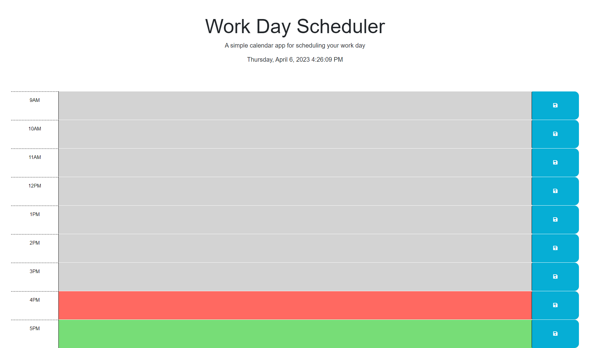
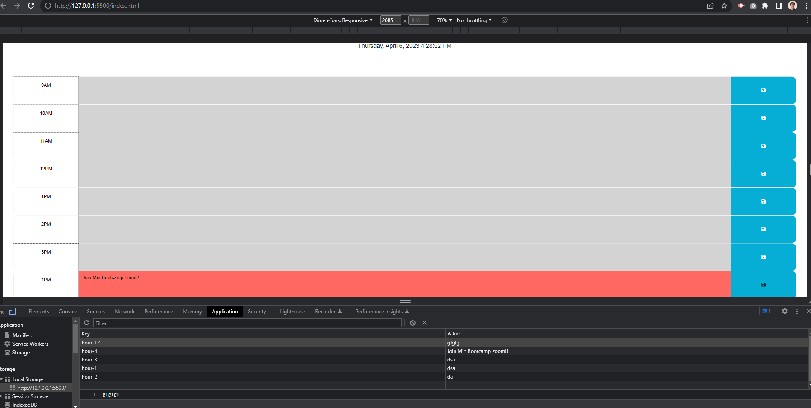

## Objective
Create an application that will allow a user to to save events for each hour of the day.

- App will run and feature dynamic HTML and CSS powered by JQuery.

- App will utilize Day.js library to work with time and date.

## Acceptance Criteria

* Current day is displayed at the top of the calendar
* User is presented with time blocks for standard business hours
* Blocks are color-coded to indicate whethewr it is in the past, present, or future
* Events are editable
* Events are saved to local storage and persist after refresh

## Requirements
* Clone starter code
* Modify code to meet Acceptance Criteria
* Application loads without error
* Repo follows best practice with multiple commits
* Quality README with description, Sreenshot, and Link to deployed app

## Is Complete When...
* Acceptance criteria is met 
* Requirments are satisfied

## Screenshot of Deployed Planner

# Deployed Site
https://tomarmenta86.github.io/TJ-DailyPlanner/

# Citation 
## Starter code reference
https://github.com/coding-boot-camp/crispy-octo-meme.git